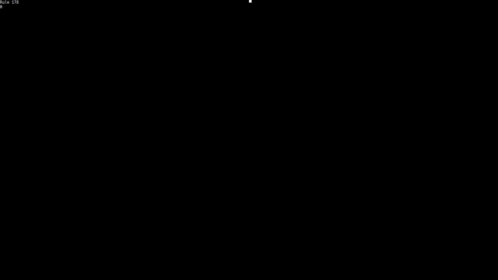

# screensaver
A fun little project I try to work on and update every once in a while. I just think it looks nice. It generally has a theme of cellular automata, but I'll add anything that's simply fun to stare at. If you want to use it as a proper screensaver, you'll need something to actually run and close the program when necessary. Personally, I use AutoIt, and have included my script here. Also, the font I use can be found at https://sourcefoundry.org/hack/
### Features
Life-like cellular automata

Langton's ant-like cellular automata

Elementary cellular automata

Various pathfinding algorithms over life-like cellular automata

N-body gravity and inelastic collision simulation

World-building cellular automata thing

Bouncy balls!

